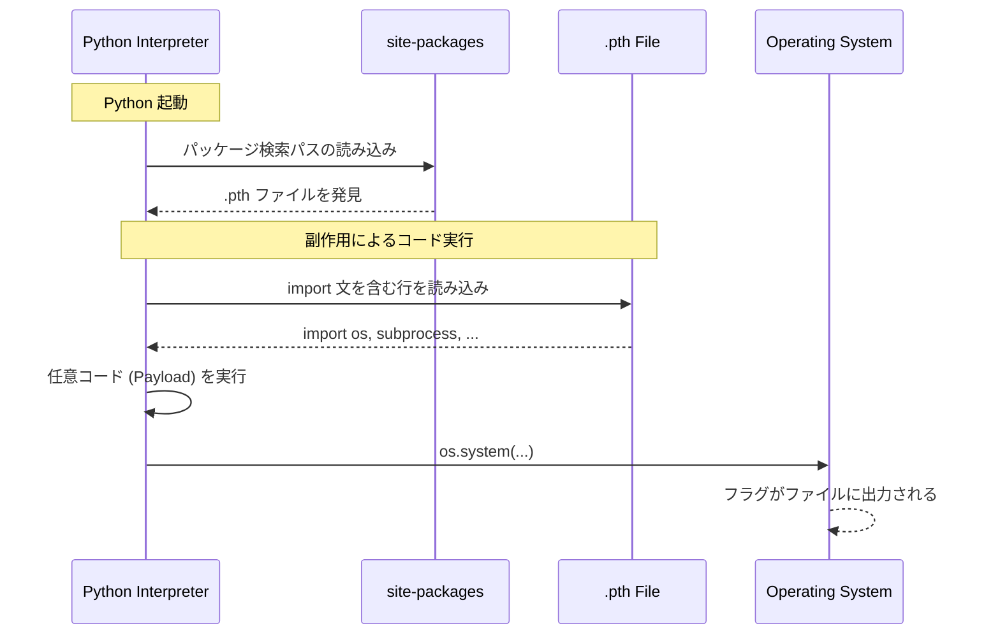

> [!IMPORTANT]
> **Solved with Google Antigravity**
> この問題は Google の AI コーディングアシスタント **Antigravity** を活用して解決されました。

# LiteAlpaca - Daily AlpacaHack

## 問題概要
「`litealpaca` モジュールに何かおかしなものが紛れ込んだ。何が起きたか分かるか？」という問題です。
この課題は、Pythonパッケージの配布形式である Wheel 内に仕込まれた **Supply Chain Attack (サプライチェーン攻撃)** をテーマにしています。

## 攻撃の仕組み：.pth ファイルによる任意コード実行
Pythonの `site-packages` ディレクトリ（ライブラリがインストールされる場所）に配置される **`.pth` ファイル**（Path Configuration Files）は、本来ライブラリパスを追加するためのものですが、「`import` 文から始まるコードをインタープリタ起動時に実行する」という副作用があります。

今回の問題では、ライブラリをインストール（またはパスに追加）しただけで、悪意のあるコードが実行される仕組みが構築されていました。

### 攻撃フローの図解


## 技術的な詳細

### 1. 不審なファイルの特定
提供されたファイルを調査したところ、以下のパスに不審な `.pth` ファイルが見つかりました。
`litealpaca/chall/extracted-wheel/litealpaca-1.0.0-py3-none-any.whl/litealpaca_init.pth`

### 2. ペイロードの解析
このファイルには、Base64で難読化された以下のコードが含まれていました。

```python
import os, subprocess, sys; subprocess.Popen([sys.executable, "-c", "import base64; exec(base64.b64decode('aW1wb3J0IG9zOyBvcy5zeXN0ZW0oImVjaG8gJ0FscGFjYXtQeVBJX3A0Y2s0ZzNzX2M0bl9iM19kNG5nM3IwdXN9JyA+IC90bXAvZmxhZy50eHQiKQ=='))"])
```

Base64部分をデコードすると、以下のようになります。

```python
import os; os.system("echo 'Alpaca{PyPI_p4ck4g3s_c4n_b3_d4ng3r0us}' > /tmp/flag.txt")
```

このコードにより、環境にこのパッケージがインストールされる（またはパスに含まれる）と、フラグが `/tmp/flag.txt` に書き出されます。

## 攻略手順
本リポジトリに含まれる `solution.py` を実行することで、`.pth` ファイル内に隠されたフラグを抽出できます。

```bash
python solution.py
```

## 学んだこと
- **サプライチェーンの信頼性**: 信頼できない PyPI パッケージや Wheel ファイルをインストールすることは極めて危険であり、明示的にインポートすらしていない状態で任意のコードが実行される可能性があります。
- **.pth ファイルの挙動**: 本来はパス指定のためのファイルですが、`import` 行を併用することでバックドアとして機能することを学びました。
